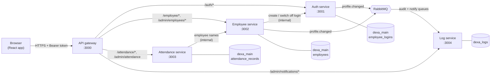
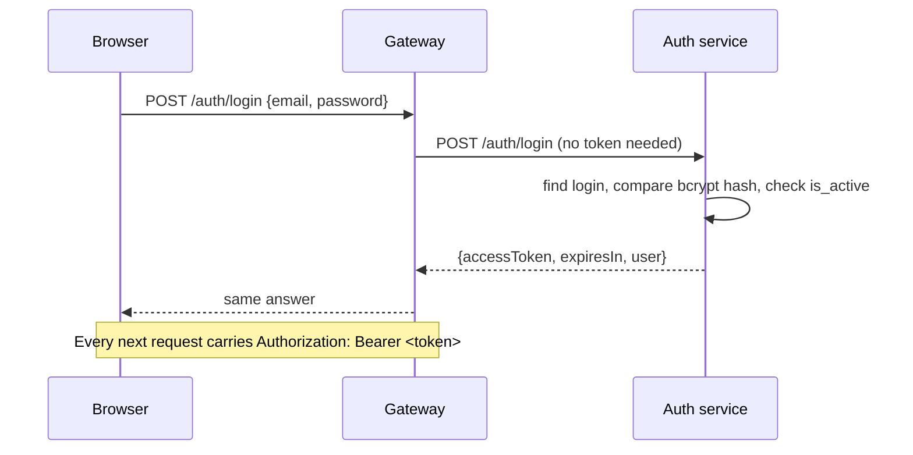
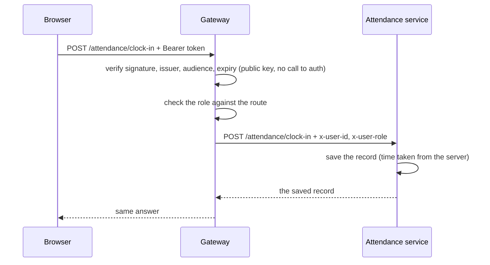
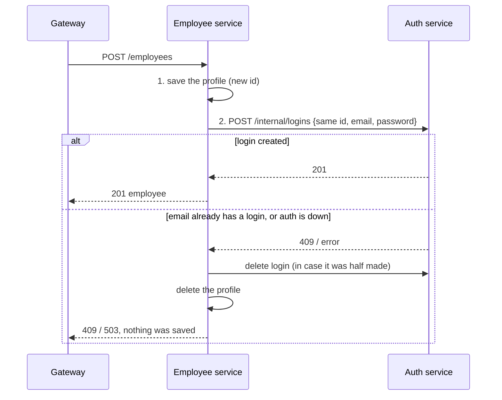

# Architecture

## The picture



Only the gateway can be reached from outside. Everything else lives inside the Docker network.

## The services

| Service | Port | Owns | Does |
|---|---|---|---|
| **api-gateway** | 3000 (published) | nothing | Checks the token and the role, forwards the request, serves the Swagger docs. No business logic |
| **auth-service** | 3001 | `employee_logins` | Logs in, issues tokens, changes passwords, creates and switches off logins for the employee service |
| **employee-service** | 3002 | `employees` | Employee profiles: read and change my own, admins add and change employees |
| **attendance-service** | 3003 | `attendance_records` | Clock in, clock out, today, the personal summary, the list for HR |
| **log-service** | 3004 | the `dexa_logs` database | Turns `profile.changed` events into audit rows and admin notifications |

Shared code lives in `backend/libs`:

| Library | Holds |
|---|---|
| `@app/config` | Environment validation, JWT settings, the database settings, `@CallerId()` and `@CallerRole()` |
| `@app/messaging` | Event types, the RabbitMQ topology, the publisher and the consumer |
| `@app/clients` | `EmployeeClient`, used to look up employee names from another service |

## Rules the design follows

1. **One owner per table.** Only the owning service reads and writes it. Other services ask through its API.
2. **No foreign keys across services.** `attendance_records.employee_id` points at an employee that belongs to another service, so the database cannot check it. The services keep it right instead.
3. **The gateway decides who you are, the services believe it.** The gateway verifies the token, then sends the id and role as the headers `x-user-id` and `x-user-role`. The services read those headers and never see a token. This is safe only because the services cannot be reached from outside. See [security.md](security.md).
4. **Internal routes stay internal.** Routes under `/internal/*` are for service-to-service calls. The gateway does not expose them.
5. **Synchronous calls for answers, events for consequences.** If the caller needs the result now, it is a REST call. If something merely has to happen afterwards (log it, tell the admins), it is an event.

## What happens in the main flows

### Logging in



### A normal request (for example "clock in")



The gateway never asks the auth service whether a token is good: it checks the signature itself with the public key.

### Adding an employee (a saga)

An employee exists in two places: a profile in the employee service and a login in the auth service. There is no shared transaction, so the employee service does the two steps in order and undoes the first if the second fails.



Switching an employee on or off works the other way round: the login is changed first, and put back if saving the profile then fails. The calls to the auth service are idempotent, so repeating them is safe.

### A profile change reaching the admins

See [events.md](events.md). In short: the service saves the change, publishes `profile.changed`, and the log service writes an audit row and a notification from it. Admins see the notification the next time their page asks (every 15 seconds).

## When a part is down

| Down | What still works | What does not |
|---|---|---|
| Auth service | Every request that already has a token (the gateway checks tokens itself) | Logging in, changing a password, adding or switching off an employee (503, nothing changes) |
| Employee service | Clock in and out, today, the summary | Profiles and the employee screens (502). The attendance list for HR still answers, but with empty names |
| Attendance service | Everything else | Clock in and out, summary, the attendance list (502) |
| Log service | Everything an employee does | The admin notifications (502). Events wait in the queue and are handled when it is back |
| RabbitMQ | Every profile change still succeeds | Notifications and audit rows for changes made meanwhile are **lost** (no outbox yet, see [known-limitations.md](known-limitations.md)) |
| PostgreSQL | Nothing | Everything except the gateway's token checks |

## Repository layout

```
.
├── docker-compose.yml
├── docs/                      these documents
├── backend/
│   ├── apps/
│   │   ├── api-gateway/       guards, routing, Swagger (src/docs holds the documentation decorators)
│   │   ├── auth-service/
│   │   ├── employee-service/
│   │   ├── attendance-service/
│   │   └── log-service/
│   ├── libs/                  config, messaging, clients
│   ├── database/              migrations (main and log database), seeds
│   ├── test/                  shared test setup
│   └── scripts/               generate-jwt-keys.mjs
└── frontend/                  React app
```

Each service has the same shape: `src/` with its module, controller, service, entities and `dto/`, and `test/` for integration tests.
