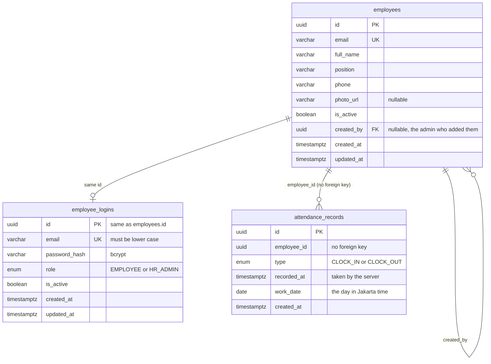

# Data model

Two PostgreSQL databases on one server.

| Database | Owned by | Tables |
|---|---|---|
| `dexa_main` | employee, auth and attendance services (one table each) | `employees`, `employee_logins`, `attendance_records` |
| `dexa_logs` | log service | `profile_change_logs`, `notifications`, `admin_notification_state` |

`dexa_logs` has its own database role (`dexa_logs`). That role cannot read `dexa_main`, so even a mistake in the log service cannot reach employee data.

## `dexa_main`



### `employees` (employee service)

The profile. `created_by` points at the admin who added the person, and is empty for the first admin. Switching a person off sets `is_active = false`, nothing is deleted.

### `employee_logins` (auth service)

The way in. A login has **the same id as its employee**, which is how the two services stay linked without a foreign key. The database refuses an email that is not lower case (`CHK_employee_logins_email_lowercase`), so lookups never depend on case. The password is only stored as a bcrypt hash.

An employee and their login are made together by a saga, see [architecture.md](architecture.md). The seed does the same in one transaction.

### `attendance_records` (attendance service)

One row per event, so a full day is two rows: a `CLOCK_IN` and a `CLOCK_OUT`.

- `UNIQUE (employee_id, work_date, type)` is the rule "one clock in and one clock out per day". Two clock-in requests at the same moment cannot both succeed: the second one hits the constraint and becomes a `409`.
- `work_date` is stored next to `recorded_at` so lists and filters need no time zone arithmetic. It is the Jakarta date of `recorded_at`.
- `employee_id` has **no foreign key** on purpose: the employee belongs to another service. Names for the HR list are fetched from the employee service when needed, and shown empty if it cannot be reached.
- An index on `work_date` serves the HR list, which filters by date across everybody.

## `dexa_logs`

| Table | Holds | Notes |
|---|---|---|
| `profile_change_logs` | One row per event: who changed whose profile, which fields (with old and new value for phone and photo, only the field name for a password), when | `event_id` is unique, so an event delivered twice is stored once |
| `notifications` | One row per event for the admins: employee, the changed field names, when | `event_id` unique. Never holds values. A notification is "new" for an admin if it is newer than that admin's `last_seen_at` |
| `admin_notification_state` | One row per admin: `last_seen_at` | Only moves forward |

The two tables are separate on purpose: the audit log is a record to keep, the notifications are a short-lived view for the screen (only the last 30 days are shown).

## Migrations and seeds

- The schema is created by **hand-written SQL migrations** in `backend/database/migrations` (main) and `backend/database/log-db/migrations` (logs). The services never change the schema themselves (`synchronize` is off).
- In Docker the `migrate` container runs them before the services start: `npm run db:migrate` (main migrations, then creates the log database and role, then the log migrations).
- A new migration is added to the list in `backend/database/data-source-options.ts` (main) or `backend/database/log-db/data-source.ts` (logs). It is not found automatically.
- Useful commands, from `backend/`:

```bash
npm run migration:show        # which migrations ran
npm run migration:run
npm run migration:revert      # undo the last one
npm run logs:migration:show   # same, for the log database
npm run seed                  # development people (never in production)
```

TypeORM's `migration:generate` can be used to compare entities with the database. The only difference it shows today is the `gen_random_uuid()` default of some `id` columns, which is intended.
