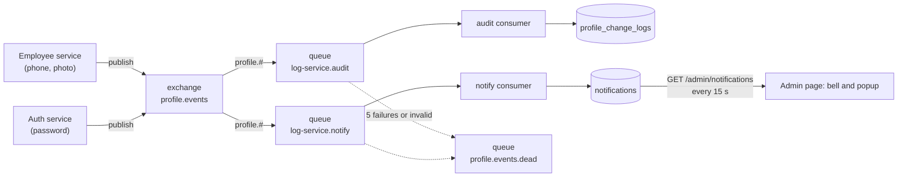

# Events: how a profile change reaches the log and the admins

The requirement: when an employee changes their profile, the admins get a popup, and the change is written to a log in a separate database. This is done with RabbitMQ so the employee's request does not wait for either of them.



## The event

One kind of event exists: `profile.changed` (routing key `profile.changed`).

```json
{
  "eventId": "7d0f6c0e-...",
  "occurredAt": "2026-10-09T08:39:52.138Z",
  "employeeId": "54f0a24b-...",
  "changedBy": { "id": "54f0a24b-...", "role": "EMPLOYEE" },
  "changes": [
    { "field": "phone", "from": "081298765432", "to": "081234567890" },
    { "field": "photoUrl", "from": null, "to": "https://example.com/a.png" },
    { "field": "password" }
  ]
}
```

- A **password change carries only the field name**, never a value, not even a hash.
- An event is only published when something really changed: saving the same phone number again publishes nothing.
- Published today for changes **made by the employee** to their own phone, photo address and password. Changes made by an admin to an employee are not published.
- The shape is checked on arrival (`parseProfileChangedEvent` in `backend/libs/messaging/src/events.ts`).

## Publishing

`EventPublisher.announceProfileChanged` is fire and forget. The service saves the change first and then publishes, using a channel with publisher confirms. If the broker is down the failure is logged and the user's request still succeeds. There is no outbox, so such an event is lost (see [known-limitations.md](known-limitations.md)).

The connection recovers by itself when RabbitMQ restarts.

## Consuming

Two queues are bound to the exchange, so each event is handled twice, independently: once to write the audit row, once to make the notification. A failure in one never blocks the other.

| Situation | What happens |
|---|---|
| Normal | Handle, then acknowledge |
| The message is not a valid event | Sent to the dead queue at once (retrying cannot fix it) |
| Handling fails (for example the database is down) | Wait, then try again: 2 s, 4 s, 6 s, 8 s, up to 10 s between tries |
| Still failing after **5** attempts | Rejected without requeue, which sends it to the dead queue |
| The same event arrives twice | Stored once: `event_id` is unique and the insert ignores a duplicate. The second delivery is acknowledged |

The number of attempts is counted from the `x-acquired-count` header that RabbitMQ keeps for quorum queues. A plain "requeue" does not count towards `x-delivery-limit`, which is why the consumer counts itself.

## The topology

Both the publisher and the consumers declare it when they connect, so the order in which services start does not matter.

| Name | Type | Settings |
|---|---|---|
| `profile.events` | topic exchange, durable | |
| `log-service.audit`, `log-service.notify` | quorum queues | bound with `profile.#`, dead-letter to `profile.events.dead`, delivery limit 5 |
| `profile.events.dead` | fanout exchange and quorum queue | holds what could not be handled |

## The admin notification

1. The notify consumer inserts a row in `notifications` (field names only, never the values).
2. The admin page asks `GET /admin/notifications` every 15 seconds. The answer has the newest notifications and `unreadCount`.
3. A notification is new for an admin when it is newer than that admin's `last_seen_at`. Each admin has their own.
4. Opening the bell calls `POST /admin/notifications/seen` with the time of the newest item. The marker only moves forward, so an old request cannot make notifications "new" again.

It is a poll, not a push. A notification can appear up to 15 seconds late.

## Looking at the queues

The RabbitMQ management page is at http://localhost:15672 (from this machine only). The login is the one in `RABBITMQ_URL` in `backend/.env`.

- **Queues** tab: `log-service.audit` and `log-service.notify` should be empty (messages are handled in milliseconds). A growing number means a consumer is failing.
- `profile.events.dead` should be empty. A message in it was given up on. Read it with **Get messages**, fix the cause, and move it back to the exchange by hand.
- The log service writes a warning for every failed attempt and an error when it gives up.
