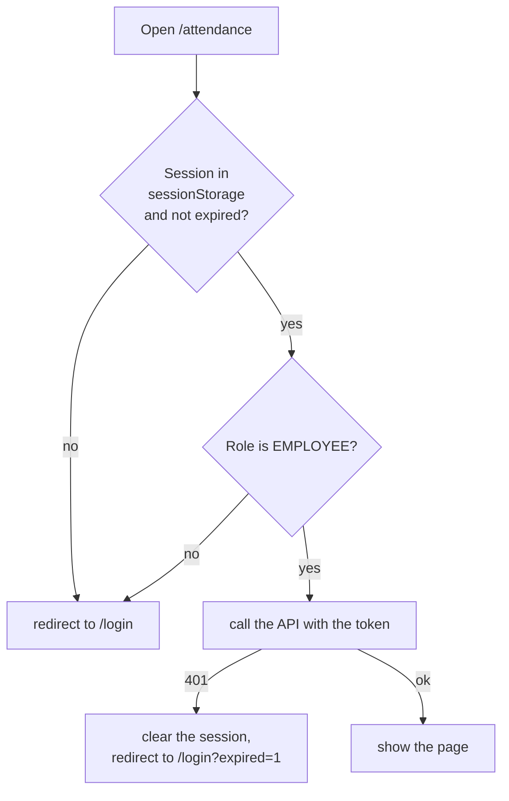

# Frontend

One React app for both kinds of user. Employees and HR admins have separate login pages and separate parts of the app, and each part checks the role.

| | |
|---|---|
| Framework | React Router 8 in framework mode (`ssr: true`), React 19, Vite |
| Styling | Tailwind CSS 4 |
| Talks to | The API gateway only. The address comes from `VITE_API_URL` (default `http://localhost:3000`) |
| Run | `npm run dev` from `frontend/`, at http://localhost:5173 |

## Pages

| Path | Who | What |
|---|---|---|
| `/` | | Redirects to `/login` |
| `/login` | public | Employee login |
| `/admin/login` | public | HR admin login |
| `/attendance` | employee | Today's status with the clock in or clock out button |
| `/summary` | employee | Attendance over a date range, with totals |
| `/profile` | employee | Profile, phone number, photo address and password |
| `/admin/employees` | HR admin | List with search and pages, add and change employees, switch accounts on and off |
| `/admin/attendance` | HR admin | Everybody's attendance, filtered by date and employee (read only) |

Every page of an admin also shows the notification bell.

## How a page loads its data

Pages load data in a `clientLoader`, in the browser, because the token lives in the browser. The server renders only the shell and the `HydrateFallback` ("Loading..."). Each of the two groups of pages (employee and admin) has a layout route whose loader does the guard.



## The code

```
frontend/app/
├── routes.ts            the list of pages
├── routes/              one file per page; employee/ and admin/ each have a layout.tsx that guards the group
├── components/          app-shell (navigation), notification-bell, employee-form, date-range-filter, ui pieces
└── lib/
    ├── api.ts           apiFetch, ApiError, joins a list of error messages into one text
    ├── session.ts       save, load, clear the session in sessionStorage
    ├── guards.ts        requireRole, loadWithSession (the 401 handling), redirectIfLoggedIn
    ├── use-authorized.ts  the same 401 handling for calls made after the page loaded (buttons, forms)
    ├── auth.ts, employee.ts, attendance.ts, admin-*.ts, notifications.ts   one small module per part of the API
    └── validation.ts, date.ts   checks before sending, date helpers
```

## Things worth knowing

- **Session**: `{ accessToken, expiresAt, user }` under the key `dexa.session` in `sessionStorage`. It disappears when the tab is closed. An expired session is removed the first time it is read.
- **A 401 means log in again**, anywhere: the session is cleared and the user lands on their login page with `?expired=1`, which shows a message.
- **Filters and pages are in the address** (`?from=...&page=2`), so a refresh or a shared link shows the same view.
- **Forms check first, then the server decides.** `validation.ts` repeats the simple rules for quick feedback. The backend is the one that enforces them, and its messages are shown when it says no.
- **The notification bell** asks for notifications every 15 seconds and marks them as seen when opened. See [events.md](events.md).
- **Photo**: a profile has a photo *address*, not an uploaded file.

## Not done

- No frontend tests.
- Not part of `docker-compose.yml` (the `Dockerfile` exists but is not wired in). Run it with `npm run dev`.
- `app/lib/dummy-data.ts` is left over from the first mock-up; only a type from it is still imported (`employee-context.ts`).
