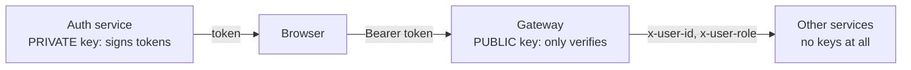

# Security

## Logging in and the token

| Topic | How it is done |
|---|---|
| Token | A signed JWT, algorithm **RS256**, valid for 1 hour (`JWT_EXPIRES_IN_SECONDS`) |
| Claims | `sub` (the user id), `role`, `iss`, `aud`, `iat`, `exp` |
| Key split | Only the auth service has the private key, so only it can make a token. The gateway has the public key, which can check a token but never make one. The other services have neither |
| Checks at the gateway | Signature, expiry, issuer, audience, **and** that `sub` is a UUID and `role` is a known role. Only RS256 is accepted, so a token with `alg: none` or one signed with HS256 using the public key as a secret is refused |
| Failure answer | Every bad token gets the same `401 "Invalid or expired token"`, so a caller learns nothing about why |
| Where the token lives | In the browser's `sessionStorage`: gone when the tab closes. See [frontend.md](frontend.md) |

## Who may do what

The gateway has two global guards, in this order: first "who are you" (token), then "are you allowed" (role).

| Route group | Access |
|---|---|
| `POST /auth/login` | Anybody |
| `/auth/password`, `/employee/me`, `/attendance/*` | Any logged-in user, for their own data |
| `/admin/*` | `HR_ADMIN` only |

Employees can only reach their own data because every "me" route takes the id from the token, not from the request. There is no way to ask for somebody else's attendance through the employee routes.

## Passing identity to the services

After the checks the gateway builds two headers, `x-user-id` and `x-user-role`, from the token and sends them to the service. Headers that a client sends are never forwarded, so a client cannot fake them. The token itself is not forwarded either.

This model trusts the network: the services believe the headers because only the gateway can talk to them. That holds as long as their ports stay unpublished (see `docker-compose.yml`: only port 3000 is published for the backend). If a service were ever exposed, anybody could claim any identity. See [known-limitations.md](known-limitations.md).

## Passwords

- Stored with **bcrypt** (cost 10). Nothing else is stored.
- 8 to 72 bytes. 72 is the real limit of bcrypt, so longer passwords are refused instead of being silently cut.
- A login with an unknown email still runs a bcrypt comparison, so the time taken does not show whether the email exists. A wrong email, a wrong password and a switched-off account give the same `401`.
- A new password must differ from the current one, and the current one must be right.
- Passwords never appear in responses, logs or events.

## Input

- Every body and query is a typed class checked by `class-validator` in the service that owns the rule. Fields that are not declared are dropped (`whitelist`), so a caller cannot send `isActive` or `role` where they do not belong.
- The gateway does **not** validate: it passes the body on and the service decides. The types in the gateway are for readers and for the documentation.
- Values from the path (an employee id) are encoded before they are put in the address of a service, so `..%2F` cannot reach another route.
- Query values the gateway does not know are dropped, not forwarded.
- All database access goes through TypeORM with parameters. The one hand-written query (the HR attendance list) uses numbered parameters.
- The employee search escapes `%` and `_`, so a search for `%` finds a percent sign and not everybody.

## CORS

Only the origins in `CORS_ORIGINS` (the frontend) may call the gateway from a browser, with the methods `GET`, `POST`, `PATCH`, `DELETE` and the headers `Authorization` and `Content-Type`. There is no wildcard.

## Secrets and configuration

| Item | Handling |
|---|---|
| `backend/.env` | Ignored by git. `.env.example` is committed and holds **development defaults only** |
| `backend/keys/*.pem` | Ignored by git. Created with `npm run keys:generate`. Mounted read-only into the containers |
| Seed passwords | `SEED_ADMIN_PASSWORD` and `SEED_EMPLOYEE_PASSWORD` in `.env`. The seed refuses to run when `NODE_ENV=production` |
| Database roles | `dexa_logs` cannot read `dexa_main` |
| Production | Every value in `.env.example` is a development value and must be replaced. A new key pair must be made for each environment |

## Privacy

- An admin notification shows **which fields** changed, never the values.
- The audit log keeps old and new values for phone and photo address (it is a record of changes) but never for passwords.
- The log database sits behind its own role, away from the employee data.

## What has tests

The token checks, the role table for every route, header spoofing, and the CORS rules are covered by integration tests in `backend/apps/api-gateway/test` (see [testing.md](testing.md)). The checks were also tried against deliberate breakage: removing the role check, or the check of `sub`, makes tests fail.

## What is still open

The main gaps are listed in [known-limitations.md](known-limitations.md): no way to revoke a token before it expires, no limit on login attempts, the documentation page is open, and no encryption between services inside the network.
